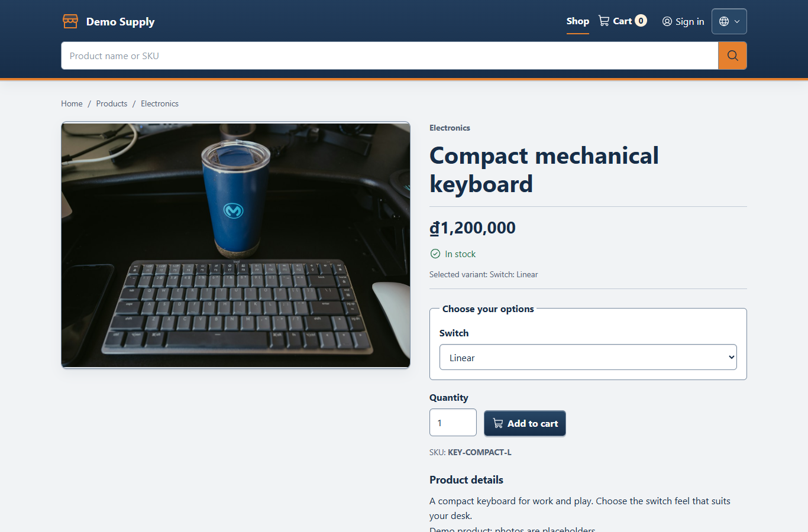
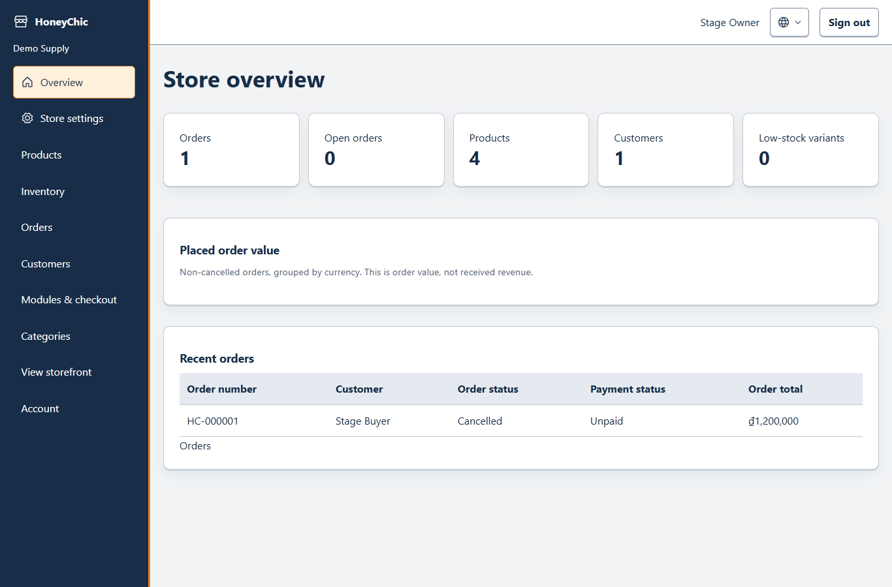
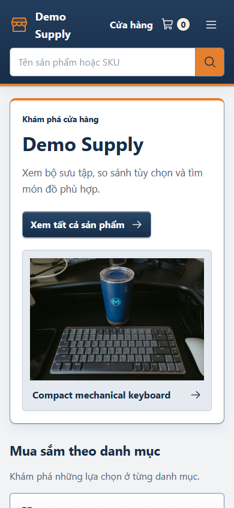
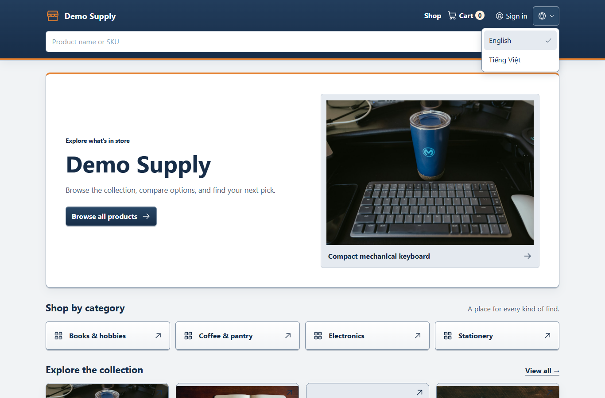

# HoneyChic

Configurable commerce for independent sellers and small shops. Built with **AdonisJS 7, Vue 3, Inertia SSR and PostgreSQL**.

HoneyChic is a self-hosted base for a shop: the owner chooses hosting, PostgreSQL, SMTP and media storage, then manages their own store name, currency and catalog. English and Vietnamese are supported throughout the interface. SMTP is built in; SMS is a future integration.


## What works today

Generic products and variants, recorded inventory movements, search, session cart, guest/account checkout, historical orders and a custom Vue admin. Reviews, wishlist, coupons, shipping and cash on delivery are optional. A fake payment gateway is available in development only.

**Merchant setup required:** production container foundations exist, but merchant launch work remains. Order mail, password reset, guest order recovery, and local image uploads are implemented. Hosted object storage is not provisioned. See [current status](docs/STATUS.md) and the [roadmap](docs/ROADMAP.md) before deploying.

<details>
<summary>More screenshots: products, administration and Vietnamese on mobile</summary>

### Product variants



### Administration



### Vietnamese on mobile



### English / Tiếng Việt

The header globe opens the language menu. Merchant product content stays exactly as entered.



</details>

## Run locally

Inside WSL Debian, with Linux Node 24, npm 11+ and Docker:

```bash
cp .env.example .env
docker compose up -d --wait
npm install
node ace generate:key
node ace migration:run
node ace db:seed
node ace owner:create
npm run dev
```

[Storefront](http://localhost:3333) · [Admin](http://localhost:3333/admin) · [Mailpit](http://localhost:8025)

The seeder adds a mixed demo catalog and no passwords. Demo products start at zero stock. After `owner:create`, add stock from `/admin/inventory`.

## Project notes

| Guide | Contents |
| --- | --- |
| [Status](docs/STATUS.md) / [Roadmap](docs/ROADMAP.md) | Implemented behavior, known gaps and planned work |
| [Development](docs/DEVELOPMENT.md) | Local setup, isolated tests and verification commands |
| [Architecture](docs/ARCHITECTURE.md) / [Modules](docs/MODULES.md) | Domain boundaries and optional capabilities |
| [Commerce rules](docs/COMMERCE_RULES.md) / [Database](docs/DATABASE.md) | Money, stock, snapshots, transactions and schema |
| [Deployment](docs/DEPLOYMENT.md) / [Security](docs/SECURITY.md) | Containers, migrations, backups and launch risks |
| [UI](docs/UI.md) | Navy/orange visual language and accessible interactions |

Demo photos are stored locally; see [photo sources and license](docs/MEDIA.md). Screenshots use isolated demo data in Microsoft Edge.

Laravel v1 is preserved at the unchanged `larastore-v1-final` tag. This checkout also has a private recovery archive; see [Laravel recovery notes](docs/DEVELOPMENT.md#laravel-v1-recovery). The current application is on `main`.

License: MIT, as declared in `package.json`.
