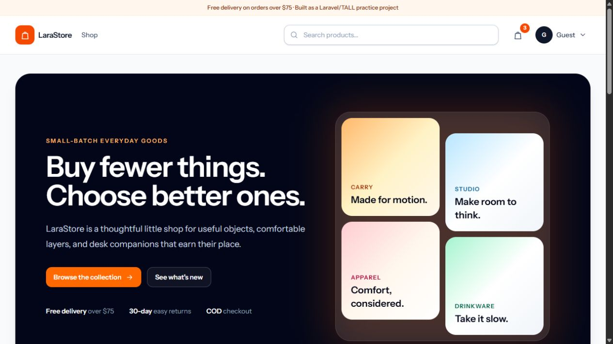
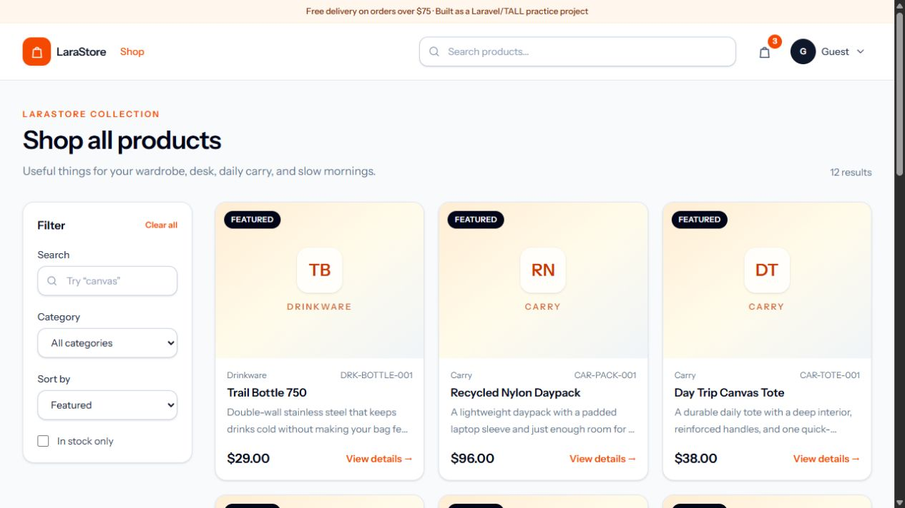
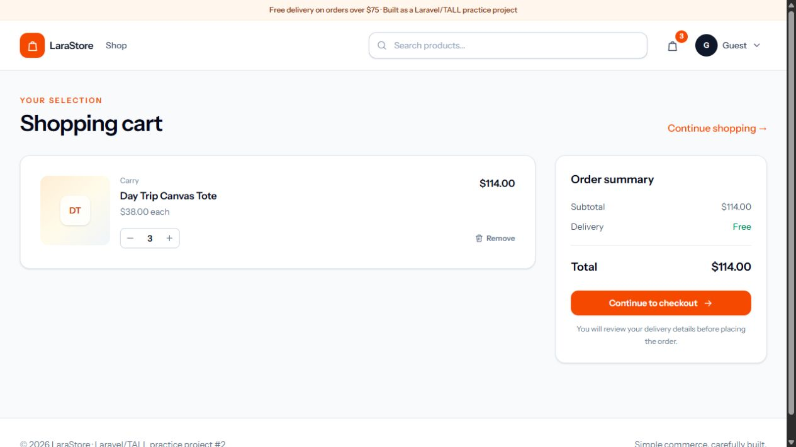

# LaraStore — project report

## Context

LaraStore is now my second Laravel practice project. The repository began as an early, rough storefront with mixed Blade, Alpine, Flux, Grid.js, and controller flows. The rebuild keeps the original small-store idea and warm orange/navy visual direction, but makes the application consistent around TALL fundamentals.

## What changed

### Foundation

- Replaced the mixed page surface with Tailwind-based Blade layouts and local inline SVG icons.
- Moved storefront, cart, checkout, account, and admin interactions into Livewire components.
- Removed the unreachable legacy customer/admin controllers, request classes, Blade trees, Grid.js modules, and starter layout fragments.
- Added a single visual language for forms, buttons, alerts, badges, empty states, product cards, and status controls.
- Fixed the login controller's missing `LoginRequest` import and removed the duplicate Alpine runtime that prevented browser-side Livewire actions from working.

### Commerce fundamentals

- Added a session `CartManager` with quantity, stock, published-state, subtotal, and stale-product checks.
- Added checkout validation and a database transaction that locks products, snapshots order data, decrements stock, and records status history.
- Added customer order listing/detail pages, cancellation with stock restoration, and review submission for fulfilled orders.
- Added admin CRUD/moderation surfaces for products, categories, orders, customers, and reviews.
- Added product soft deletes, featured products, order/customer/product snapshots, order status history, and reviews.

### Assistant and configuration safety

- Added a Livewire shop-assistant bubble with local answers for delivery, returns, payment, orders, stock, cart, account, and catalogue questions.
- Added an optional OpenAI-compatible LLM fallback behind a short server-side timeout. The system instruction is customizable by an admin, while non-negotiable safety rules are appended in application code.
- Added an admin-only `/admin/chatbot` settings screen. API keys are encrypted with Laravel's encrypted cast, never loaded into a public Livewire property, never displayed after saving, and can be replaced or cleared.
- Added a 500-character input limit, twelve requests per minute per session/IP, bounded chat history, prompt-extraction refusal, and a local fallback when the provider is disabled or unavailable.

### Data and documentation

- Rebuilt the seed around a portable SQLite database with 4 categories, 12 curated products with fitting photography, 4 sample orders, realistic stock movement, 4 users, and 7 approved product reviews.
- Updated CI to install and build the Vite frontend before migrations and tests.
- Captured the screenshots in this folder from the running seeded local app.

## Verification

The following checks passed during the rebuild:

- `php artisan route:list --except-vendor`
- `php artisan test --env=testing` — 9 tests, 19 assertions
- `npm run build` — Vite production build succeeded
- Fresh local migration and seed — 4 users, 4 categories, 12 products, 4 orders, 8 order lines, 7 approved reviews, and the chatbot settings table
- Browser smoke pass — image-backed storefront cards, collection filters, product details, seeded reviews, quantity controls, live cart badge, cart summary, login screen, assistant FAQ response, and admin chatbot settings

The browser pass also caught and fixed a real issue that request-level tests missed: two Alpine runtimes were fighting over Livewire's event handling. The app now lets Livewire provide Alpine consistently.

## Screenshots

## Deliberate scope limits

This is not production commerce. There is no real payment processor, shipping integration, tax/coupon system, guest checkout, image-upload pipeline, email delivery service, or deployment setup. Cash on Delivery and local mail logging are intentional practice-project boundaries.

## Next sensible experiments

1. Add a small product-image upload flow with validation and storage cleanup.
2. Add a fake payment adapter behind an interface before considering a real provider.
3. Add browser tests for authentication, admin transitions, cancellation, and review eligibility.
4. Add a lightweight order notification job using the existing database queue.

The current stopping point is intentional: the common store flows are understandable, seeded, visually coherent, and working before adding infrastructure that would obscure the Laravel/TALL learning goals.
